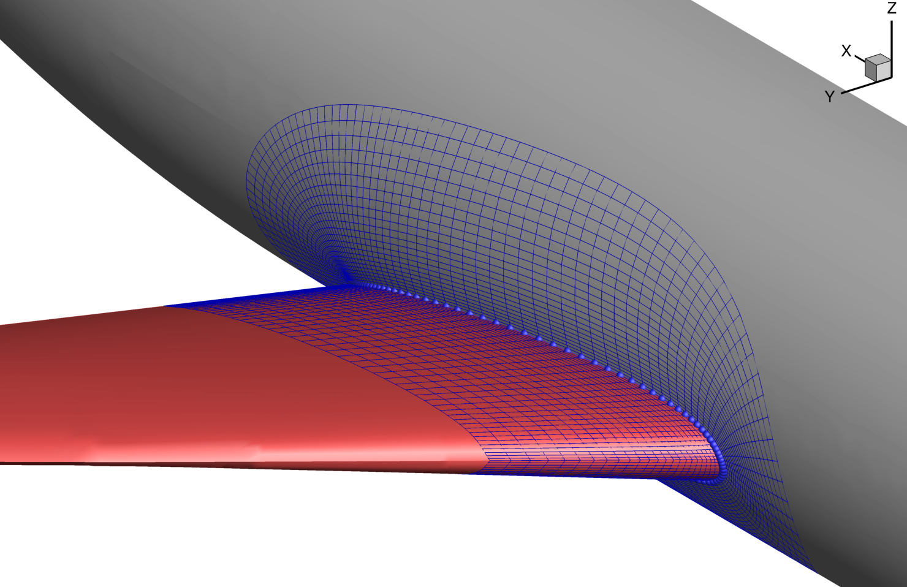

pySurf
======
[](https://mdolab-pysurf.readthedocs-hosted.com/en/latest/?badge=latest)

pySurf is a tool that computes intersections between bodies and create collar surface meshes for use in overset CFD.
pySurf uses unstructured discrete surfaces as inputs to describe each primary component.
These surfaces are used to compute intersections between components and regenerate collar meshes automatically at each optimization iteration.
This tool also computes derivatives of mesh points with respect to shape deformation design variables, which enables gradient-based aerodynamic shape optimization.
An example of the pySurf-generated surface collar mesh from a wing-body intersection is shown below.



Citation
--------

Please cite the [pySurf journal article](https://arc.aiaa.org/doi/abs/10.2514/1.J056550) if you use any part of this code.

Ney R. Secco, John P. Jasa, Gaetan K. W. Kenway, and Joaquim R. R. A. Martins.  "Component-Based Geometry Manipulation for Aerodynamic Shape Optimization with Overset Meshes", AIAA Journal, Vol. 56, No. 9 (2018), pp. 3667-3679.

```
@article{Secco2018b,
	Author = {Ney R. Secco and John P. Jasa and Gaetan K. W. Kenway and Joaquim R. R. A. Martins},
	Doi = {10.2514/1.J056550},
	Journal = {AIAA Journal},
	Month = {September},
	Number = {9},
	Pages = {3667--3679},
	Title = {Component-based Geometry Manipulation for Aerodynamic Shape Optimization with Overset Meshes},
	Volume = {56},
	Year = {2018}}
```

How pySurf fits within MACH
---------------------------

pySurf takes triangulated surface meshes, intersects them, and creates surface collar meshes.
That means that you will first need a geometry representation, which may come from CAD (as an .iges file) or from [pyGeo](https://github.com/mdolab/pygeo).
This geometry representation can then be imported into ICEM where you can create the triangulated surface meshes needed in pySurf.
Once you generate the surface collar meshes, you can use [pyHyp](https://github.com/mdolab/pyhyp) to extrude the surface meshes into volume meshes.
These meshes can then be used in [ADflow](https://github.com/mdolab/adflow) to perform CFD.
An example [XDSM](https://github.com/mdolab/pyXDSM) for an optimization that uses pySurf is shown below.


License
-------
Copyright 2016-2019 MDO Lab

Licensed under the Apache License, Version 2.0 (the "License");
you may not use this file except in compliance with the License.
You may obtain a copy of the License at

   http://www.apache.org/licenses/LICENSE-2.0

Unless required by applicable law or agreed to in writing, software
distributed under the License is distributed on an "AS IS" BASIS,
WITHOUT WARRANTIES OR CONDITIONS OF ANY KIND, either express or implied.
See the License for the specific language governing permissions and
limitations under the License.
